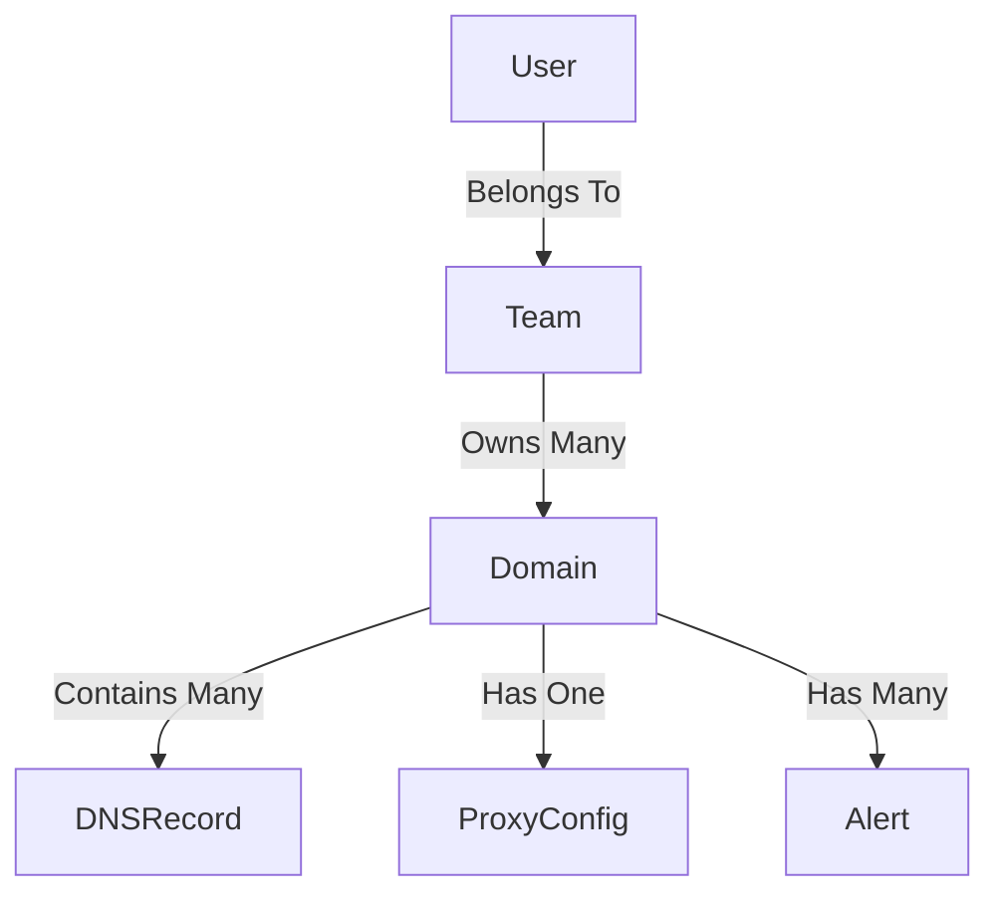

# Database Schema & Data Models

Netgoat uses **MongoDB** as its primary persistent storage system for Control Plane and Admin functions. Because our system requires near-instant read availability mapping complex relational graph data across tenants, Mongoose schemas bridge relational modeling strategies within a document store syntax.

The Edge Data Store (`DuckValue`) is wholly separate—it does not interact with this schema list.

## Core Collections

### 1. Teams & Users
At the root of the hierarchy are *Teams*. A User inherently belongs to one or more Teams, serving as our primary mechanism for multi-tenant isolation.
- `User` Schema stores identity, authentication tokens, and references `teams` array (`[ObjectID]`).
- `Team` is the ultimate boundary. All domains, DNS records, and alerts belong completely to a `Team`.

### 2. Domain & DNS Ecosystem
- **`Domain` Collection**: The central entity representing a managed hostname (e.g., `api.example.com`). It tracks TLS lifecycle (Pending, Active, Expired), ownership flags, and global traffic routing rules (WAF status).
- **`DNSRecord` Collection**: Children to a single `Domain`. Represents A, AAAA, CNAME, or MX records. 
  - *Linking*: Maintains a direct `domainId` (`ObjectId`, ref: `'Domain'`). A query for a zone involves matching all `DNSRecord` instances pointing to a specific `domainId`.

### 3. Proxy Configurations
- **`ProxyConfig` Collection**: Stores complex WAF rules, caching strictness, edge-function injects, and custom rate limits natively. 
  - *Linking*: Every configure matches a specific `domainId`. When the Edge Node connects via WebSocket, the Control Plane performs an aggregate lookup of `Domain` + its active `ProxyConfig` and broadcasts the merged model down the wire.

### 4. Observability & Reporting
- **`Alert` & `Incident` Collections**: Handle uptime tracking and system anomalies. When an edge node reports a 502 Bad Gateway streak, an `Incident` is created here, referencing the affected `Domain`.
- **`Analytics` Data**: Time-series log records representing traffic volume (aggregated into minutes or hour chunks) assigned to a specific `domainId`.

## Entity Relationship Summary

The central pillar dictating schema design is the `Team`.

Because MongoDB doesn't enforce strict joins, application logic within the Control Plane leverages standard `.populate()` or explicit reference queries to map `DNSRecords` into a single JSON payload for Edge push synchronization.
